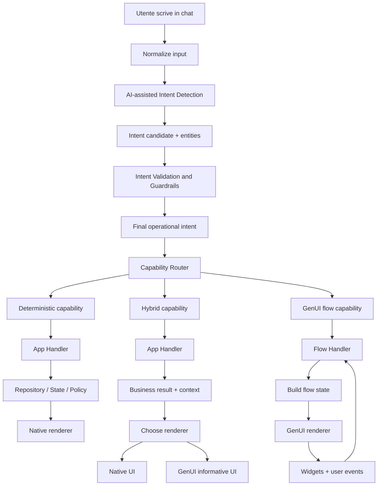
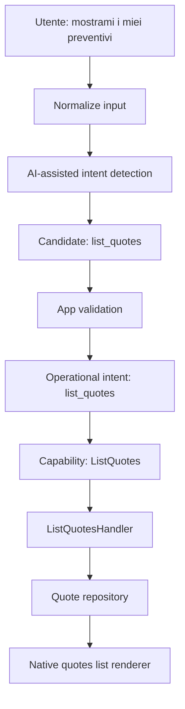
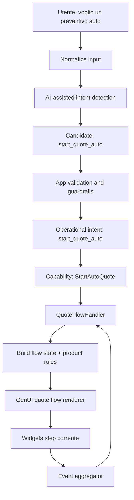
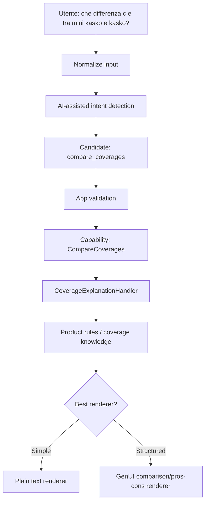
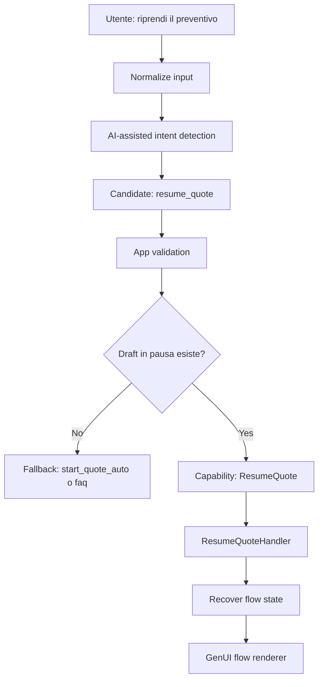

# Architettura target per GenUI assicurativa

## Obiettivo

Definire una architettura target per una app assicurativa che usa Generative UI senza trasformare il modello nel punto di controllo principale del prodotto.

L'obiettivo non e rendere GenUI "piu generica" in senso assoluto, ma usarla nel punto giusto:

- il codice applicativo decide quale lavoro eseguire
- il modello aiuta a interpretare il linguaggio naturale
- GenUI costruisce interfacce dinamiche solo dove porta valore

Questa architettura serve a evitare due problemi opposti:

- una chat troppo rigida, che e solo un funnel travestito
- una pseudo-app in cui il prompt sostituisce la logica applicativa

## Principio guida

La regola centrale e:

- `LLM suggests`
- `App validates`
- `App decides`

Il modello puo proporre un intent candidato e dei parametri estratti dalla richiesta utente.
Il codice applicativo valida quel candidato, applica i guardrail, usa il contesto reale dell'app e decide l'intent operativo finale.

In questa struttura:

- l'AI fa interpretazione linguistica
- l'app fa arbitraggio, stato, policy e business logic

## Perche questa architettura e adatta a GenUI

Una app con Generative UI robusta non dovrebbe delegare al modello la responsabilita di decidere il comportamento core del sistema.

Il modello e molto utile per:

- capire richieste formulate in modi diversi
- estrarre focus e sfumature semantiche
- costruire UI dinamiche e microcopy contestuale
- rendere spiegazioni informative piu chiare e adattive

Il modello non dovrebbe essere l'autorita finale per:

- routing di intent operativi
- accesso a dati utente
- gestione di stato e resume
- policy di business
- navigazione e azioni affidabili
- validazione di prerequisiti

Per questo la struttura corretta e:

- `Intent detection` ampia
- `Capability routing` nel codice
- `Handler` applicativi per esecuzione
- `Renderer` nativo o GenUI a seconda del caso

## Visione generale

La pipeline target e questa:



## I livelli dell'architettura

### 1. Input normalization

Questo layer normalizza la richiesta utente prima di qualunque classificazione:

- lowercase
- pulizia punteggiatura
- normalizzazione spazi
- eventuale estrazione di pattern semplici
- eventuale disambiguazione terminologica minima

Esempio:

- input: `Vorrei fare un preventivo Kasko!!!`
- normalized: `vorrei fare un preventivo kasko`

Questo passaggio non decide nulla. Riduce solo rumore e variabilita.

### 2. AI-assisted intent detection

Questo e il punto in cui il modello entra in modo utile ma controllato.

Il modello non produce direttamente una action eseguibile. Produce invece un candidato strutturato:

- `intent_candidate`
- `product`
- `focus_coverage`
- `quote_scope`
- `target_quote_reference`
- `confidence`
- eventuali note di ambiguita

Esempio:

```json
{
  "intent_candidate": "start_quote_auto",
  "product": "auto",
  "focus_coverage": "kasko",
  "quote_scope": "comparison",
  "confidence": 0.84
}
```

Lo scopo di questo livello e linguistico:

- riconoscere parafrasi
- interpretare frasi meno rigide
- estrarre entita utili
- aiutare il router a non dipendere solo da keyword fisse

### 3. Intent validation and guardrails

Questo livello appartiene interamente all'app.

Riceve l'output del modello e lo valida rispetto a:

- elenco degli intent ammessi
- stato reale della chat
- supporto del prodotto
- dati disponibili
- prerequisiti minimi
- policy e vincoli di business

Questa e la parte che decide l'intent operativo finale.

Esempi di controlli:

- l'intent e tra quelli consentiti?
- il prodotto richiesto e supportato in chat?
- esiste un flow attivo o in pausa?
- l'utente sta davvero chiedendo una ripresa?
- ci sono dati minimi per aprire il dettaglio di un preventivo?
- serve un fallback informativo?

Possibili esiti:

- conferma del candidato proposto dall'LLM
- correzione del candidato
- downgrade a un intent piu sicuro
- fallback a FAQ o chiarimento

Esempio:

- LLM propone `resume_quote`
- il codice controlla che non esista alcun flow in pausa
- il sistema corregge in `start_quote_auto` oppure `insurance_faq`

### 4. Capability router

L'intent operativo finale non decide direttamente il rendering.

Decide quale capacita dell'app attivare.

Una `capability` e una unita applicativa concreta che rappresenta una cosa che il sistema sa fare.

Esempi:

- `ListQuotes`
- `ShowQuoteDetails`
- `StartAutoQuote`
- `ResumeQuote`
- `ExplainCoverage`
- `CompareCoverages`
- `PolicySupport`
- `ClaimsSupport`

Questo livello scala meglio di un router monolitico perche:

- separa il "cosa fare" dal "come renderlo"
- consente a piu input diversi di attivare la stessa capability
- permette di cambiare il renderer senza cambiare intent o capability

### 5. Handlers

Ogni capability ha un handler responsabile dell'esecuzione.

L'handler:

- legge repository e stato
- applica regole di business
- costruisce il contesto
- decide cosa e pronto per essere renderizzato

L'handler non dovrebbe occuparsi di:

- interpretare il linguaggio utente
- generare direttamente UI dinamica

Le sue responsabilita sono applicative.

Esempi:

- `ListQuotesHandler`
- `ShowQuoteDetailsHandler`
- `QuoteFlowHandler`
- `CoverageExplanationHandler`
- `ClaimsSupportHandler`

### 6. Renderer

Solo a questo punto si decide la forma della risposta.

Il renderer puo essere:

- `native`
- `plain_text`
- `genui_info`
- `genui_flow`
- `hybrid`

Questo e un punto chiave dell'architettura:

- lo stesso intent puo avere renderer diversi
- la stessa capability puo avere renderer diversi
- GenUI non e obbligatoria per ogni risposta

Esempi:

- `ListQuotes` -> renderer nativo
- `ShowQuoteDetails` -> renderer nativo
- `ExplainCoverage` -> testo semplice o `genui_info`
- `StartAutoQuote` -> `genui_flow`
- `ClaimsSupport` -> `hybrid`

## Distinzione tra intent, capability, handler e renderer

### Intent

Rappresenta cio che l'utente sta cercando di fare.

Esempi:

- `list_quotes`
- `show_quote_details`
- `start_quote`
- `resume_quote`
- `explain_coverage`

### Capability

Rappresenta una capacita concreta dell'app.

Esempi:

- `ListQuotes`
- `ShowQuoteDetails`
- `StartAutoQuote`
- `ResumeQuote`
- `ExplainCoverage`

### Handler

Rappresenta il codice applicativo che esegue quella capacita.

Esempi:

- legge il repository
- carica un draft
- costruisce uno stato di flow
- applica policy o regole di eligibility

### Renderer

Rappresenta il modo in cui il risultato viene presentato.

Esempi:

- lista nativa
- schermata di dettaglio
- messaggio testuale
- info card GenUI
- wizard GenUI step-by-step

## Perche l'intent non deve decidere direttamente il rendering

Se l'intent decide gia il rendering finale, il router diventa presto un blocco centrale che:

- interpreta la frase utente
- sceglie la logica business
- decide i widget
- decide le schermate
- decide le transizioni

Questo porta a un router monolitico.

La separazione corretta e:

- `intent` identifica il bisogno
- `capability` identifica la capacita da attivare
- `handler` esegue il caso d'uso
- `renderer` sceglie la forma della risposta

Questa struttura consente di:

- sostituire un renderer senza toccare il resto
- aggiungere nuove capability senza riscrivere il router
- limitare GenUI ai punti in cui e davvero utile
- mantenere spiegabile il comportamento del sistema

## Tipologie di capability

### 1. Deterministic capability

Richieste che dipendono da dati, stato o policy affidabili.

Esempi:

- mostrare i preventivi
- aprire un dettaglio
- verificare se esiste un draft in corso
- accedere a una sezione documenti

Per queste capability il renderer ideale e quasi sempre nativo.

### 2. Hybrid capability

Richieste che richiedono una parte affidabile e una parte generativa.

Esempi:

- spiegare una copertura dopo aver recuperato regole di prodotto
- guidare l'utente in un task reale con supporto informativo
- aprire una funzione nativa e aggiungere una spiegazione contestuale

Qui il flusso tipico e:

- handler applicativo
- costruzione contesto
- GenUI informativa oppure testo strutturato

### 3. GenUI flow capability

Richieste che beneficiano di una UI dinamica guidata, ma dentro un flow controllato.

Esempi:

- nuovo preventivo auto
- ripresa preventivo
- onboarding guidato di un prodotto

In questo caso GenUI e il renderer principale, ma:

- il flow state resta nell'app
- la progressione resta nell'app
- il completamento resta nell'app

## Flow dettagliato dei casi principali

### Caso 1: mostrare i preventivi



Qui GenUI non porta vantaggio reale.

### Caso 2: avvio preventivo auto



Qui GenUI e corretta perche:

- rende dinamicamente lo step corrente
- raccoglie dati con widget controllati
- adatta il microcopy

Ma non decide il completamento del flow.

### Caso 3: spiegazione coperture



Qui GenUI puo aiutare, ma non e obbligatoria.

### Caso 4: ripresa preventivo



Questo esempio mostra bene perche il codice deve avere l'ultima parola.

## AI-assisted intent detection in dettaglio

## Obiettivo

Usare il modello come motore di classificazione linguistica e estrazione entita, senza affidargli il controllo finale del comportamento dell'app.

## Output atteso dal modello

L'LLM dovrebbe produrre un output strutturato e limitato a un piccolo schema.

Esempio di campi:

- `intent_candidate`
- `product`
- `focus_coverage`
- `quote_scope`
- `target_quote_reference`
- `needs_clarification`
- `confidence`

Esempio:

```json
{
  "intent_candidate": "resume_quote",
  "product": "auto",
  "focus_coverage": "kasko",
  "quote_scope": "comparison",
  "target_quote_reference": "ultimo",
  "needs_clarification": false,
  "confidence": 0.76
}
```

## Intent ammessi

L'output del modello deve essere confinato a un elenco chiuso.

Esempio iniziale:

- `list_quotes`
- `show_quote_details`
- `start_quote`
- `resume_quote`
- `explain_coverage`
- `compare_coverages`
- `policy_support`
- `claims_support`
- `insurance_faq`
- `unknown`

Se il modello produce altro, il codice lo tratta come non valido.

## Guardrail applicativi

I guardrail minimi dovrebbero includere:

- validazione schema
- validazione enum degli intent
- validazione prodotto supportato
- compatibilita con `ChatMode`
- presenza di flow attivi o in pausa
- verifica di entita realmente risolvibili
- fallback se confidence bassa o output ambiguo

Esempi:

- `resume_quote` senza draft in pausa -> fallback
- `show_quote_details` senza riferimento risolvibile -> chiarimento o lista
- `start_quote` su prodotto non supportato -> risposta controllata
- `compare_coverages` con coperture sconosciute -> `insurance_faq`

## Decision table semplificata

| Candidate LLM | Contesto app | Esito |
| --- | --- | --- |
| `resume_quote` | Esiste draft in pausa | Conferma `resume_quote` |
| `resume_quote` | Nessun draft in pausa | Correggi in `start_quote` o `insurance_faq` |
| `show_quote_details` | Riferimento chiaro | Conferma |
| `show_quote_details` | Riferimento ambiguo | Chiarimento o `list_quotes` |
| `start_quote` | Prodotto supportato | Conferma |
| `start_quote` | Prodotto non supportato | Fallback controllato |
| `unknown` | Nessun altro segnale | `insurance_faq` |

## Capability target iniziali

Per evitare complessita precoce, conviene partire con un insieme limitato e stabile.

### Capability di consultazione

- `ListQuotes`
- `ShowQuoteDetails`
- `ShowLatestQuote`

### Capability operative

- `StartAutoQuote`
- `ResumeQuote`

### Capability informative

- `ExplainCoverage`
- `CompareCoverages`
- `InsuranceFaq`

### Capability di assistenza

- `PolicySupport`
- `ClaimsSupport`

## Regole per decidere quando usare GenUI

GenUI va usata quando serve almeno una di queste cose:

- raccolta guidata e progressiva dei dati
- UI dinamica in base allo stato del flow
- contenuto informativo strutturato meglio del solo testo
- adattamento contestuale controllato

GenUI non va usata come default per:

- query dati deterministiche
- navigazione verso risorse precise
- decisioni di business
- retrieval di record utente
- resume o eligibility verificata solo dal modello

Regola pratica:

- se la richiesta richiede affidabilita, dati o policy -> handler applicativo
- se richiede forma, guida o spiegazione adattiva -> renderer GenUI

## Mapping sul progetto attuale

La base del repo e gia vicina a questa direzione:

- esiste un `ChatIntentDetector`
- esiste un `ChatOrchestrator`
- esiste `ChatMode`
- esiste un `QuoteFlowOrchestrator`
- esiste un `QuoteProductRegistry`
- esiste un catalogo GenUI controllato

Oggi pero la struttura e ancora piu vicina a:

- pochi intent
- orchestrazione semplice
- quote flow centrato sul prodotto auto
- uso di GenUI come motore principale del flow guidato

La direzione target e evolvere verso:

- detector AI-assisted
- validazione applicativa degli intent candidati
- capability esplicite
- renderer separati
- GenUI confinata a flow e risposte informative strutturate

## Proposta di componenti target

### 1. `AiIntentClassifier`

Responsabilita:

- invocare il modello su un prompt stretto
- restituire un output strutturato
- non eseguire logica di business

### 2. `IntentResolutionService`

Responsabilita:

- ricevere il candidato LLM
- applicare validazioni e guardrail
- produrre l'intent operativo finale

### 3. `CapabilityRouter`

Responsabilita:

- mappare l'intent operativo a una capability concreta
- considerare contesto e stato

### 4. `CapabilityHandler` family

Responsabilita:

- eseguire i casi d'uso
- leggere dati e stato
- costruire i result model da renderizzare

### 5. `ResponseRenderer` family

Responsabilita:

- decidere la forma finale della risposta
- nativa, testo, GenUI informativa, GenUI flow, ibrida

### 6. `GenUiFlowRenderer`

Responsabilita:

- rendere uno step del flow
- ricevere istruzioni gia controllate
- non decidere il business flow

## Contratti raccomandati

### Intent candidate

```text
IntentCandidate
- intentCandidate
- product
- focusCoverage
- quoteScope
- targetReference
- confidence
- needsClarification
```

### Operational intent

```text
OperationalIntent
- type
- product
- focusCoverage
- quoteScope
- targetReference
- source = ai_assisted | rule_based | fallback
```

### Capability result

```text
CapabilityResult
- rendererType
- payload
- metadata
```

## Strategia di implementazione incrementale

### Fase 1

- mantenere il router attuale
- introdurre un classificatore AI ristretto
- aggiungere il layer di validazione e guardrail
- mantenere gli stessi intent operativi correnti

Obiettivo:

- migliorare la comprensione linguistica senza cambiare tutto

### Fase 2

- separare intent operativi e capability
- introdurre handler dedicati
- far emergere renderer nativi e renderer GenUI come concetti distinti

Obiettivo:

- evitare crescita monolitica del router

### Fase 3

- aggiungere nuovi use case auto assicurativi
- dettaglio preventivo
- resume robusto
- supporto coperture e confronto
- policy / claims assistance

Obiettivo:

- estendere il dominio senza spostare logica nel prompt

## Anti-pattern da evitare

### 1. LLM come autorita finale dell'intent

Rischio:

- azioni non affidabili
- debugging difficile
- regressioni silenziose

### 2. Router monolitico che decide anche il rendering

Rischio:

- crescita incontrollata di `if/switch`
- scarsa modularita
- coupling tra comprensione ed esecuzione

### 3. Prompt che contiene logica applicativa

Rischio:

- regole business non testabili
- comportamento opaco
- manutenzione difficile

### 4. GenUI usata per tutto

Rischio:

- UX incoerente
- over-generation
- perdita di controllo sui task deterministici

## Conclusione

L'architettura target non e "meno AI". E piu disciplinata.

La chat resta una superficie naturale per l'utente.
Il modello resta utile per capire meglio le richieste e costruire UI dinamiche dove serve.
Ma il sistema resta una vera app:

- il codice decide il job
- il codice governa stato e business
- GenUI rende e guida l'esperienza nei punti ad alto valore

La direzione raccomandata e quindi:

- `AI-assisted intent detection`
- `app-owned validation and guardrails`
- `capability-based routing`
- `renderer separation`
- `GenUI confined to controlled flows and structured explanations`

Questo approccio permette di scalare una app assicurativa con GenUI senza trasformarla in uno switch case nascosto nel prompt e senza degradarla a funnel rigido.
